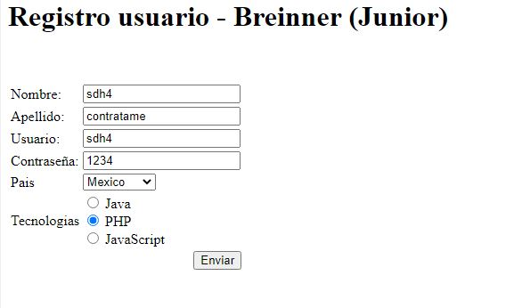
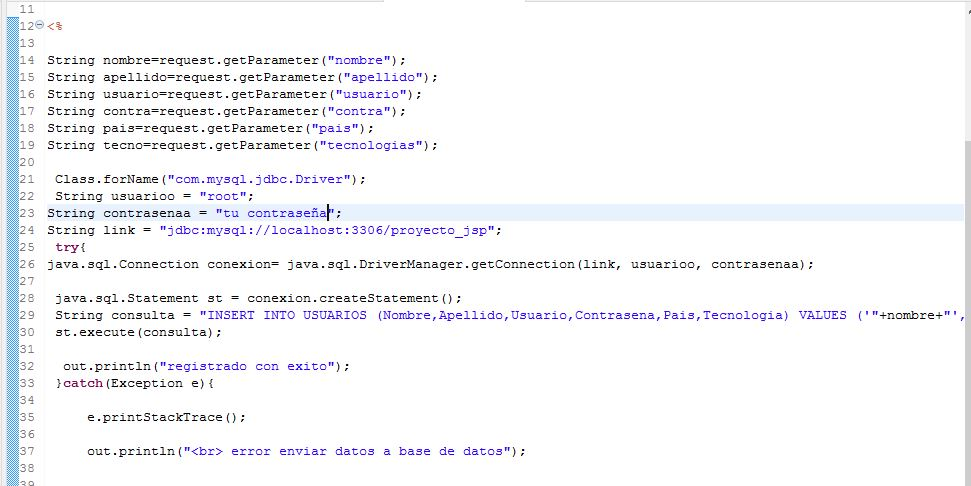
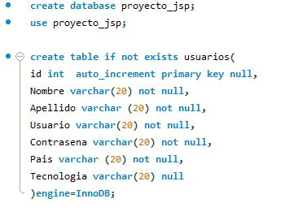
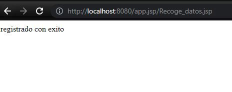
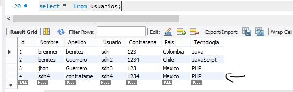
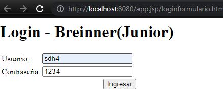
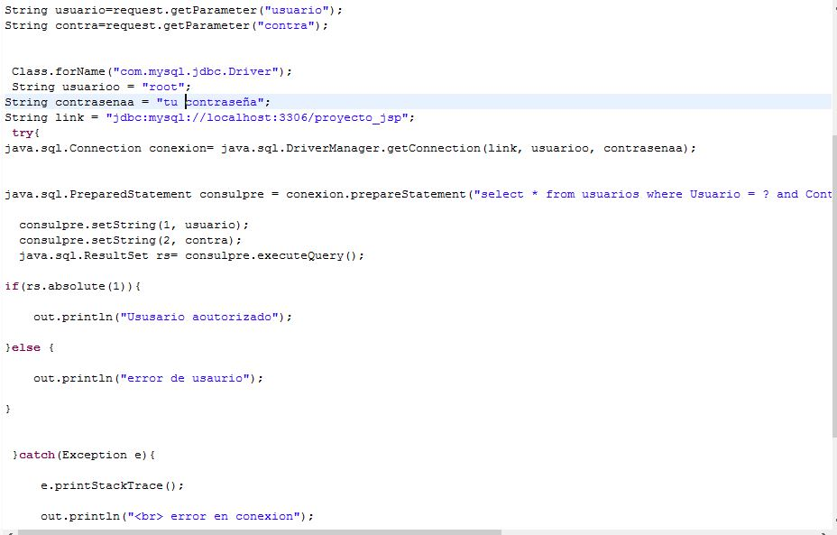
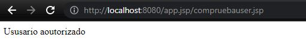

# mysql-workbench 🐬 servidor java con apache 8.5
## **Creacion  base de datos de  una entidad ,  consultas sql JDBC , Java JEE  y tomcat  🐱 **
## 

>> **Aprendizaje**

___
##  proceso 1:  ' registro.html ' se registra usuario y se envia la informacion

___
## proceso 2: una ves enviada la informacion es eviada 'Recoge_datos.jsp'

___
## proceso 3 :  estos datos son enviados a 'basedatojsp.sql' y nos  gurada los datos 

___
registrado con exito 

___
estos son los registros de la entidad usuarios
 

___
## proceso 4:  utilizamos  'loginformulario.html'  para ingresar con nuestro usuario 

___
## proceso 5: esta informacion  es enviada a  'compruebauser.jsp'  tiene una consulta preparada
## con la informacion registrada  de usuario y contraseña 
 

___

si le das ingresar y el usuario existe debe aparecer: 

